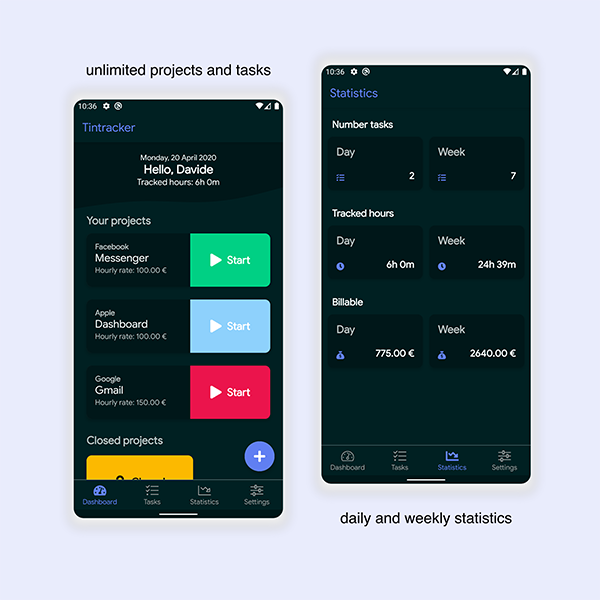
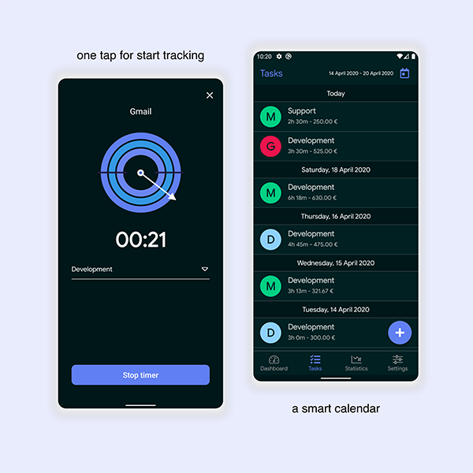

# Tintracker

This is a series of tutorial that teaches you the basics to build mobile applications following modern development standards.

In this first tutorial you build an app called **Tintracker** for tracking the time on your activities 
and for calculate your earnings. 🗂️💰

You build a complete Android application using the full potential of the **Kotlin** programming language and 
you will learn how to use **Clean Architecture** on your projects to build robust, flexible and maintainable applications.

## Course overview

- [Kotlin](https://kotlinlang.org/) - A modern programming language that makes developers happier.
- [Coroutines](https://kotlinlang.org/docs/reference/coroutines/coroutines-guide.html) - A coroutine is a concurrency design pattern that you can use on Android to simplify code that executes asynchronously.
- [Flow](https://kotlin.github.io/kotlinx.coroutines/kotlinx-coroutines-core/kotlinx.coroutines.flow/-flow/) - A cold asynchronous data stream that sequentially emits values and completes normally or with an exception.
- [Android Architecture Components](https://developer.android.com/topic/libraries/architecture) - A collection of libraries that help you design robust, testable, and maintainable apps. 
    - LiveData
    - ViewModel
    - ViewBinding
    - Room - The Room persistence library provides an abstraction layer over SQLite to allow for more robust database access while harnessing the full power of SQLite.
- [Koin](https://insert-koin.io/) - A pragmatic lightweight dependency injection framework for Kotlin developers.
- DiffUtil - DiffUtil is a utility class that calculates the difference between two lists and outputs a list of update operations that converts the first list into the second one.
- Material Components - Modular and customizable Material Design UI components for Android.
- Dark mode support
- Animation
- more...



## Contact
If you need any help, you can connect with me.

Visit [ultimatemobile.app](https://ultimatemobile.app)


## License
```
MIT License

Copyright (c) 2020 Davide Agostini

Permission is hereby granted, free of charge, to any person obtaining a copy
of this software and associated documentation files (the "Software"), to deal
in the Software without restriction, including without limitation the rights
to use, copy, modify, merge, publish, distribute, sublicense, and/or sell
copies of the Software, and to permit persons to whom the Software is
furnished to do so, subject to the following conditions:

The above copyright notice and this permission notice shall be included in all
copies or substantial portions of the Software.

THE SOFTWARE IS PROVIDED "AS IS", WITHOUT WARRANTY OF ANY KIND, EXPRESS OR
IMPLIED, INCLUDING BUT NOT LIMITED TO THE WARRANTIES OF MERCHANTABILITY,
FITNESS FOR A PARTICULAR PURPOSE AND NONINFRINGEMENT. IN NO EVENT SHALL THE
AUTHORS OR COPYRIGHT HOLDERS BE LIABLE FOR ANY CLAIM, DAMAGES OR OTHER
LIABILITY, WHETHER IN AN ACTION OF CONTRACT, TORT OR OTHERWISE, ARISING FROM,
OUT OF OR IN CONNECTION WITH THE SOFTWARE OR THE USE OR OTHER DEALINGS IN THE
SOFTWARE.
```

 
